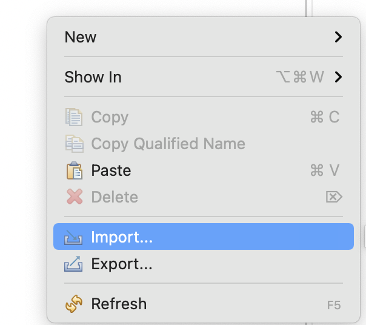
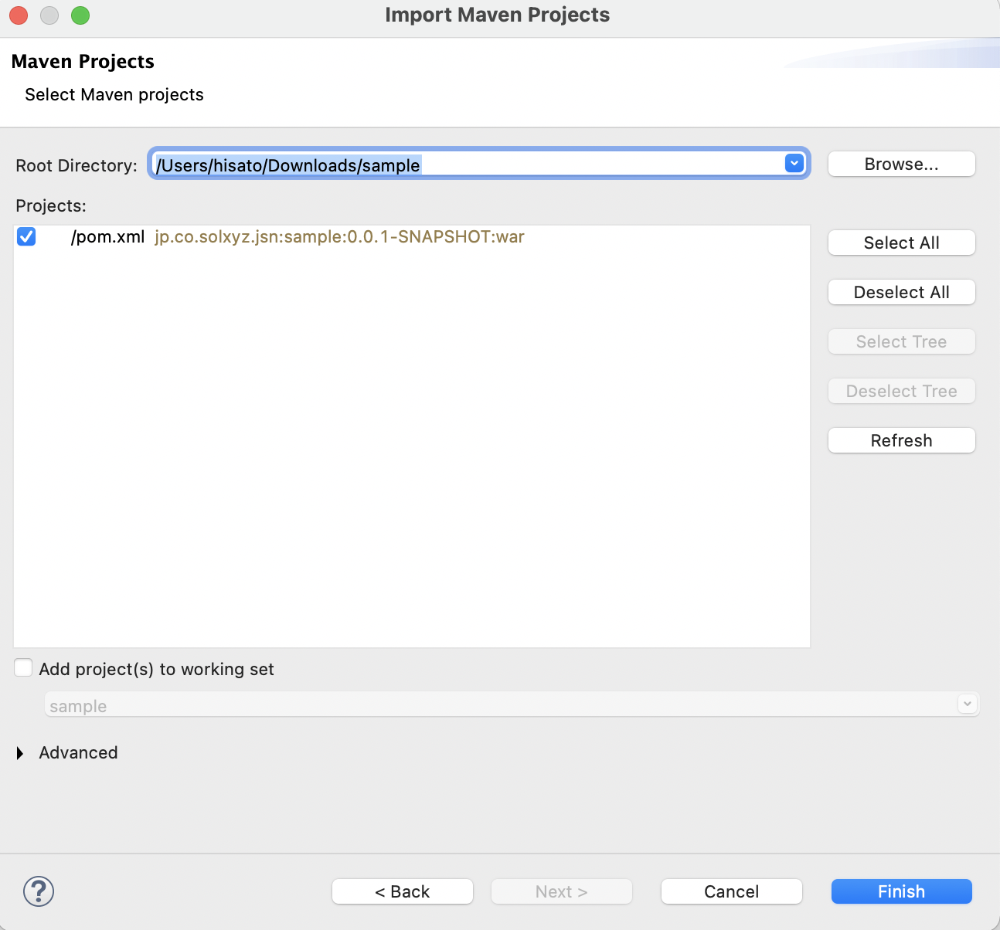
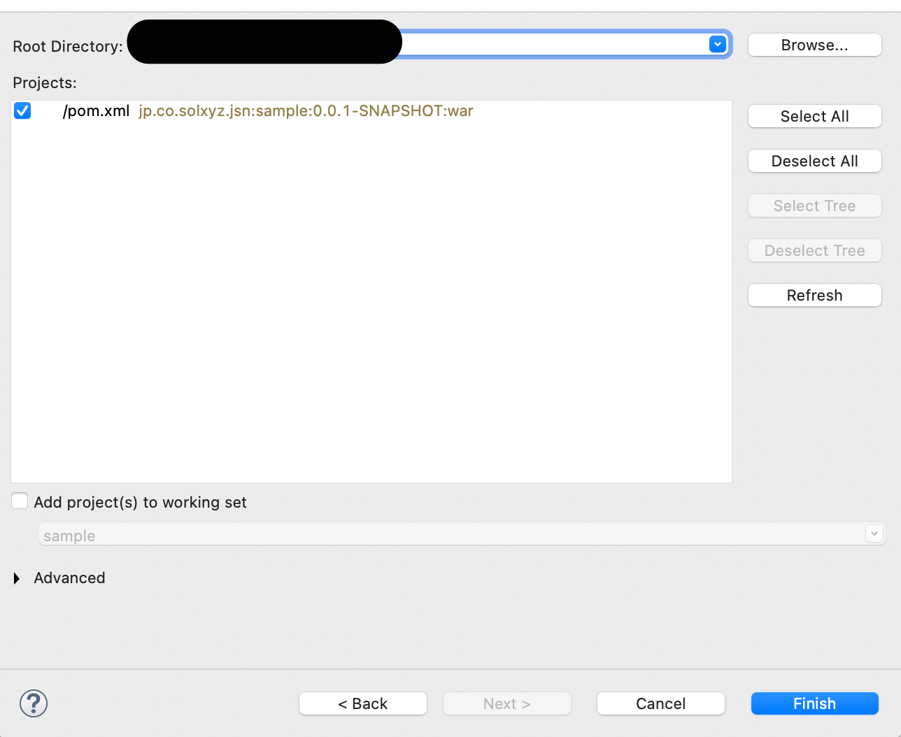

# SpringBootによるWebアプリケーション構築 サンプルコード

## 概要

SOLXYZ Academyコンテンツ「SpringBootによるWebアプリケーション構築」のサンプルコードです。

このリポジトリは、学習コンテンツの各セクションに対応する形で構成されています。各プロジェクトは、コンテンツの学習順序に沿って番号付けされており、対応するセクションで学ぶ内容を実践できるようになっています。

```
spring-boot-samples/
├── spring-01-mvc/          # はじめてのMVC
├── spring-02-template/     # テンプレートエンジンを使いこなす
├── spring-03-form/         # フォームとバリデーション
├── spring-04-di/           # DI（依存性の注入）
├── spring-05-jpa/          # JPAによるデータベース操作
└── spring-06-api/          # Springを用いたAPIの作成
```

## 使い方

### リポジトリのクローン

gitでリポジトリをクローンします。

```shell
git clone https://github.com/jsn-developer/spring-boot-api-sample.git
```

### インポート方法（Eclipseの場合）

#### Eclipseを開き、「インポートを選択」



#### インポートの種別から、「既存Mavenプロジェクト」を選択



#### クローンしたフォルダを指定し、OKを選択


